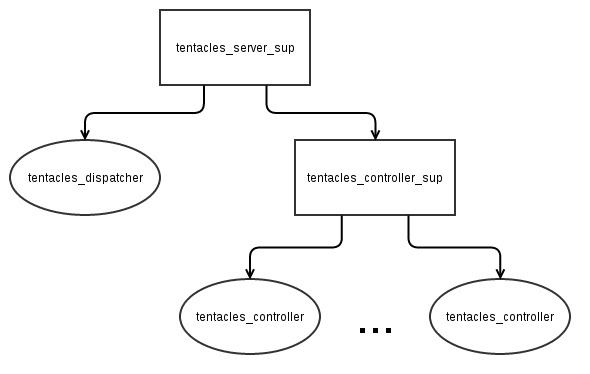

Tentacles Server
================

Tentacles server is a general purpose concurrent server written in Erlang. The server can be concurrent as long as every connection has a different identifier, otherwise is always serial.

The server when started is a supervisor of a `tentacles_dispatcher` and a supervisor for its short-lived `tentacles_controllers` (short-lived unless their max age is `infinity`).

When a connection identified by an identifier is received, `tentacles_dispatcher` forwards it to the `tentacles_controller` handles that identifier requests. If it doesn't exists, `tentacles_dispatcher` generates a `tentacles_controller` to handle the request.

A `tentacles_controller` handle every connection of a specific identifier serially. When no connection is received in *max age* milliseconds, the `tentacles_controller` dies (unless its max age is `infinity`). This serves two purposes:

1. Readiness to receive request when the traffic is high from certain identifier.
2. Low resource comsumption when the traffic from certain identifier is low.

The server process tree has the following shape:



Tests
-----

1. Download and compile:

    ```shell
    alex@arya:~$ git clone https://github.com/alexdesousa/tentacles_server.git
    (...)
    [output omitted]
    (...)
    alex@arya:~$ cd tentacles_server/
    alex@arya:~/tentacles_server$ make
    ==> proper (get-deps)
    ==> tentacles_server (get-deps)
    ==> proper (compile)
    (...)
    [output omitted]
    (...)
    ==> tentacles_server (compile)
    Compiled src/tentacles_controller.erl
    Compiled src/tentacles_dispatcher.erl
    Compiled src/tentacles_controller_sup.erl
    Compiled src/tentacles_server_sup.erl
    ```

2. Run tests:

    ```shell
    alex@arya:~/tentacles_server$ make tests
    ==> tentacles_server (eunit)
    Compiled src/tentacles_controller.erl
    Compiled src/tentacles_dispatcher.erl
    Compiled test/tentacles_test_controller.erl
    Compiled src/tentacles_controller_sup.erl
    Compiled src/tentacles_server_sup.erl
    Compiled test/tentacles_proper_test.erl
    ....................................................................................................
    OK: Passed 100 test(s).
    ....................................................................................................
    OK: Passed 100 test(s).
    ....................................................................................................
    OK: Passed 100 test(s).
    ....................................................................................................
    OK: Passed 100 test(s).
    ....................................................................................................
    OK: Passed 100 test(s).
    ....................................................................................................
    OK: Passed 100 test(s).
    ....................................................................................................
    OK: Passed 100 test(s).
    ....................................................................................................
    OK: Passed 100 test(s).
    ....................................................................................................
    OK: Passed 100 test(s).
      Test passed.
    Cover analysis: /home/alex/tentacles_server/.eunit/index.html
    ```

More Information
----------------

For more information, check out the [Tentacles Server's Wiki](https://github.com/alexdesousa/tentacles_server/wiki).
